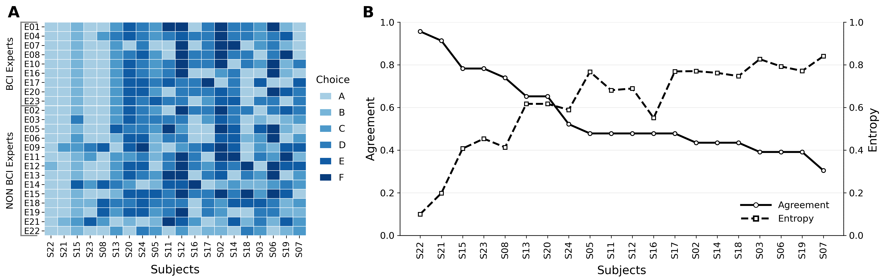
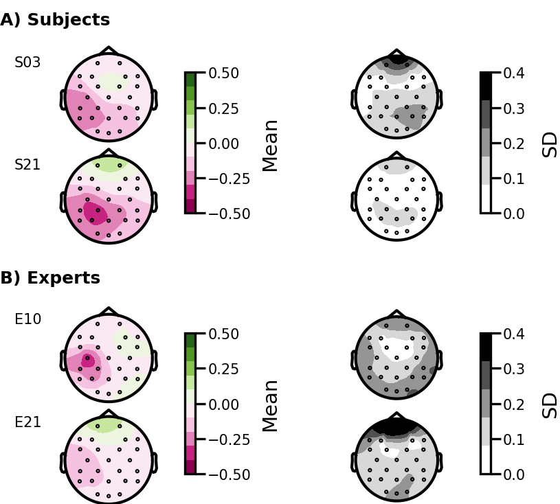
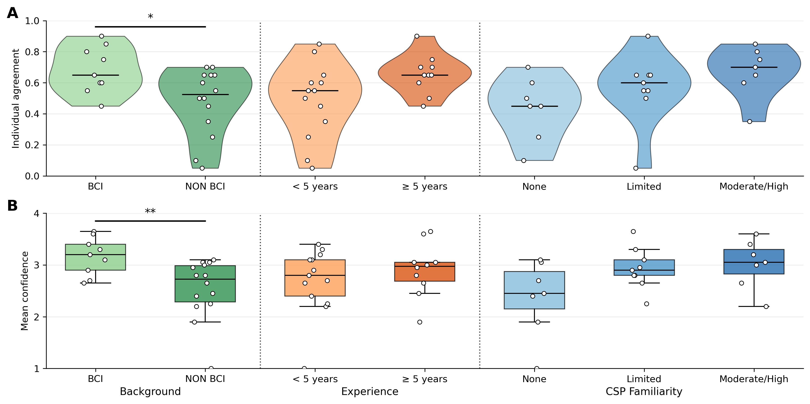

# Expert Influence and Inter-Expert Variability in CSP-Based Neurofeedback

---
This repository contains the code and supporting documents associated with the following manuscript:

C. Dumas, C. Dussard, M.-C. Corsi*, N. George* (2026). Expert Influence and Inter-Expert Variability in CSP-Based Neurofeedback. 
*co-last authors
 
---
## Authors:
* [Cassandra Dumas](https://www.linkedin.com/in/cassandra-dumas-a002a2153/), PHD Student, Sorbonne Université, Institut du Cerveau (_alias_ [@Dumas-C](https://github.com/Dumas-C))
* [Claire Dussard](https://www.linkedin.com/in/claire-dussard-92469a256/), Sorbonne Université, Institut du Cerveau (_alias_ [@cdussard](https://github.com/cdussard))
* [Marie-Constance Corsi](https://marieconstance-corsi.netlify.app), Inria Research Scientist, Sorbonne Université, Institut du Cerveau (_alias_ [@mccorsi](https://github.com/mccorsi))
* [Nathalie George](https://www.linkedin.com/in/nathalie-george-406a09167/), CNRS Research Director, Sorbonne Université, CENIR, Centre MEG-EEG, Institut du Cerveau

---
## Abstract

 Common Spatial Patterns (CSP) are widely used in motor imagery (MI)-based brain–computer interfaces (BCIs). While classification pipelines combine multiple components to optimize performance, MI-based neurofeedback (MI-NF) requires selecting a single spatial filter to drive feedback based on physiologically interpretable sensorimotor activity. This critical step is often implicit and relies on expert judgment. We quantified inter-expert variability in CSP selection using data from 20 subjects in a right-hand MI-NF experiment. Twenty-three BCI or neurophysiology experts independently selected the most physiologically relevant component among six CSP candidates per subject. Inter-expert agreement was fair overall (Fleiss’ κ = 0.256) but varied substantially across subjects. Consensus did not systematically favor the top-ranked component, and selections spanned all six candidates. Although higher-ranked components elicited stronger agreement, substantial variability persisted. These findings identify single-component CSP selection as an overlooked source of methodological heterogeneity in MI-NF systems, highlighting the need for explicit and reproducible selection criteria. 

## Code

This repository contains:
- the code used to perform the statistical analyses,
- the scripts used to generate all figures presented in the manuscript,
- and the anonymized responses to the expert questionnaire.

Computation and figures were performed with the following Python version: 3.12.7. In 'requirements.txt' a list of all the Python dependencies is proposed.

---
## Figures

### Figure 1 - Inter-expert agreement on CSP selection

*
 (A) Colormap showing the experts’ (E01, E04, … E22) component selections (A–F) for each subject (S22, S21, … S07). Subjects are ordered from highest to lowest consensus (left to right columns). Experts are grouped according to their domain of expertise: BCI experts (top rows) and non-BCI experts (bottom rows). Colors represent the selected CSP component for each expert–subject pair. (B) Inter-expert agreement (in solid black line) and normalized Shannon entropy (in dashed black line) for each subject (in the same order as in (A)). The left y-axis represents agreement (modal selection proportion; 1 = full agreement, 0 = no agreement). The right y-axis represents entropy (0 = no dispersion, 1 = maximal dispersion across choices). 
*

### Figure 2 - Topographical representation of the selected CSPs

*
 The CSPs are displayed using a green–pink color scale, with green indicating positive weights and pink indicating negative weights. The variability (SD) of the selected CSPs is represented in grey maps. (A) Mean and SD of the CSPs selected by the experts for two representative subjects (S03 and S21). (B) Mean and SD of the CSPs selected by two representative experts (E10 and E21) across all subjects. This figure illustrates both inter‑subject and inter‑expert variability in the spatial distribution of the selected CSPs. 
*

### Figure 3 - Influence of expert characteristics on agreement and confidence

*
 Comparison of individual agreement with the consensus and mean confidence across three expert characteristics: background (BCI vs non-BCI), years of experience (< 5 vs ≥ 5 years), and CSP familiarity (none, limited, moderate/high). Category blocks are separated by vertical dotted lines. White dots represent individual expert data points. (A) Individual agreement, defined as the proportion of subjects for which an expert’s selection matched the consensus (modal choice). Violin plots show the distribution within each category; the central black line indicates the median. (B) Mean confidence per expert. Boxplots display the interquartile range (Q1–Q3), the median (central line), and whiskers extending to 1.5× IQR (outliers excluded).
*
